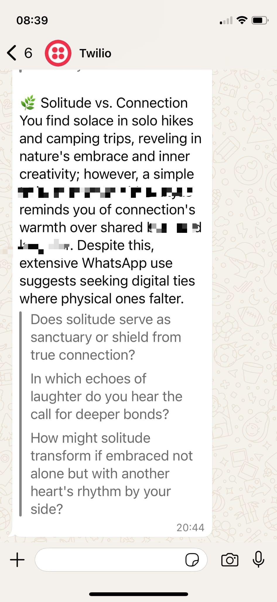

# Reflective Agentic AI

A minimal agentic AI system that sends **Socratic reflections** via WhatsApp, grounded in your digital activity: **journal**, **calendar**, **screen time**, and **weekly notes**.
Built with [LangGraph](https://github.com/langchain-ai/langgraph), OpenAI, and Twilio.



---

## What It Does

This system acts like a **personal Socrates** (or team coach), observing weekly digital signals and sending **poetic, disorienting, and emotionally intelligent questions** such as:

> 🌿 Aspiration vs. Avoidance
> Your calendar shows early-morning goals.
> But your phone whispers midnight scrolling.
> > What does your screen time say about your deeper desires?

The goal is not to advise—but to reflect and provoke awareness.

---

## How It Works

The agent follows a 3-step pipeline using LangGraph:

    P[Perceive (calendar, screen time, notes)]
    R[Reflect (Socratic AI)]
    W[Whisper (send message)]

    P --> R --> W

You provide:
- A text journal (freeform thoughts including goals, ambitions, fears etc.)
- A `.pickle` with weekly calendar events
- A `.pickle` with screen time per app
- A `.pickle` with weekly self-written notes
(There are project_s/perception_* files to help you go from images/text to pickle. And a debug.ipynb to debug along the way.)


It returns:
- A single WhatsApp message with an insight and a question.

---

## Tech Stack

- **LangGraph**: Agentic orchestration (state machine over LLMs)
- **OpenAI GPT-4o**: Socratic reflection generation
- **Twilio**: WhatsApp messaging
- **Pandas**: Preprocessing calendar + screen time data

---

## Quickstart

```bash
git clone https://github.com/your-username/reflective-agentic-ai.git
cd reflective-agentic-ai
```

1. Install dependencies
   *(Use a clean Python environment recommended)*
   ```bash
   pip install -r requirements.txt
   ```

2. Setup your `.env` and/or `config.py` with:
   ```python
   OPENAI_API_KEY = "sk-..."
   TWILIO_ACCOUNT_SID = "AC..."
   TWILIO_AUTH_TOKEN = "..."
   FROM_NUMBER = "+1415..."
   TO_NUMBER = "+41..."  # Your verified number with WhatsApp sandbox
   ```

3. Add your data in `/data/journal`, `/data/calendar`, `/data/screen_time`, `/data/weekly_notes`.

4. Run:
   ```bash
   python run_weeks.py
   ```

---

## Enterprise Variant (Optional)

You can adapt this system to **team OKRs**, **project calendars**, or **meeting summaries**, turning it into a **Collective Reflection AI**:


---

## Visuals

<table>
  <tr>
    <td></td>
  </tr>
</table>

---

## License

MIT — use freely and reflect deeply.
Attribution welcome, especially if you build something poetic ;-)
